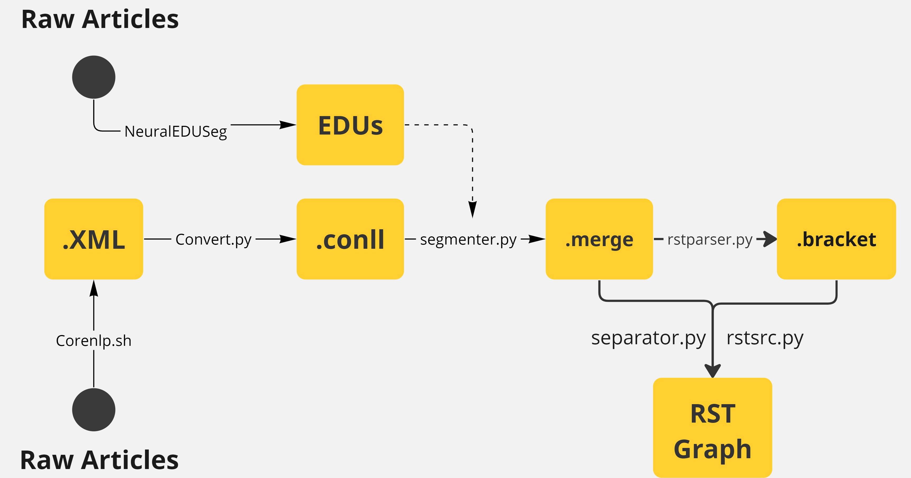

## Table of Contents
1. [General notes](#general-notes)
2. [Server Configuration](#server-configuration)
3. [Labeling](#labeling)
4. [EDU](#edu)
5. [RST](#rst)
6. [Final datasets](#final-datasets)

## General Notes
+ There are some Xsum articles that have missing 'document' field and I have removed them. The doc ids are:
  - Train: [7685, 8241, 18941, 34482, 45994, 47375, 51451, 55972, 81764, 93859, 98279, 100515, 111410, 132307, 133278, 137842, 139131, 140449, 161069, 161224, 167620, 167701, 169668, 177000, 183925, 194983, 199290, 200409]
  - Test: [11155]
  - valid: [3834, 5677, 4715, 219, 8445]
+ In case you want to long documents, You need to changed -mx2g to a higher number (like -xm7g). Since I have truncated the documents to have less than 768 BPE tokens I did not need to change the 2 Gbytes jave heapsize to a higher number.
+ Sometimes corenlp.sh does not generate xml file for some documents. In this case you just need to (usually) run that one more time on those documents that where left unprocessed.
+ Without losing the generality of the problem, I have removed '[' and ']' characters from the documents since corenlp.sh fails to properly generate xml files of documents containing those two characters.

## Server Configuration
I used remote servers of ComputeCanada Alliance and a local server.
+ Local Server Configs:
  - GPU: 12G NVIDIA TITAN XP. Driver Version: 530.41.03. CUDA version: 12.1
  - RAM: 64G
  - OS: UBUNTU 16.04
  - 10K of documents takes 2.5 days to compute xml files.
+ Compute Canada Clusters:
  - I used cedar, beluga, narval, graham, and niagara.
  - sbatch file used to process train documents on these remove servers are available in run_dplp_computeCanada.sh file.
  - On avarage it takes 4 days to compute a batch of 20K documents on each of these remove servers. Narval, however, was faster than others and I used that mostly.

## Labeling
Code snippet used for selecting important EDUs with a pre-choosen hyperparameter (maximum number of important EDUs) is provided in a notebook in labeling folder. 
+ I ran this code snippet on already processed (by Discobert paper authors) CNNDM dataset and the percision of their provided labels and our produced labels is 95%. I think the minor difference lies in the fact that they have done some preprocessing and post-processing (such as selecting EDUs with their grammatically related neighboring EDUs), yet the code is not available on their repository.
  
## EDU
### Notes:
+ There are two options for generating EDUs that work relatively the same (one of them generate some empty EDUs in between that you can later remove them with a short script):
   - *[Composing Elementary Discourse Units in Abstractive Summarization](https://www.aclweb.org/anthology/2020.acl-main.551/)*.
   - *[Toward Fast and Accurate Neural Discourse Segmentation](http://www.aclweb.org/anthology/D18-1116)*.
+ Link to the two mentioned papers' GitHub repositories respectively are:
  - *[EDUsum](https://github.com/PKU-TANGENT/EDUSum/tree/master)*
  - *[NeuralEDUSeg](https://github.com/PKU-TANGENT/NeuralEDUSeg/tree/master)*
+ You can also use DPLP repository that is being used to generate RST graphs. As mentioned on the [Discobert repository](https://github.com/Reza-Ardestani/DiscoBERT/tree/release), we can also do EDU segmentation by only relying on the DPLP code (segmenter.py generates EDU number for all tokens). DPLP, however, does not have high accuracy in its segmentation. That's why we use the result of NeuralEDUSeg segmentation to generate merge files from conll files. Merge files are exactly conll files with one more field for each token, which is the EDU number of that token. Since we already have the document segmented into EDUs we can generate .merge files from conll files by finding out to what EDU that token (in .conll files) belongs. The is another way that You can merge EDUs and put a special token between them before generating .xml files so that later you can locate differnt tokens easier.
+ The first repository is easy to run (with minimal modification) and our current EDUs are generated by it. The second one (NeuralEDUSeg), however, was dificult to run. The zipped file contains modified code for it that you can run with the commands in the following section.
### How to run:
1. Transfering raw documents into the following folder: 
```
./NeuralEDUSeg/data/rst/TRAINING/
```
2. Using neural_edu_seg_env environment, in the folder “./NeuralEDUSeg/src” run :
```
python run.py --segment --input_files ../data/rst/TRAINING/*.txt --result_dir ../data/results/
```
Then you can find the output in the "/data/results" path.
3. Finished

## RST
### Notes:
+ Corenlp.sh requires some jar files from stanfordCoreNLP webpage. These requirements are already downloaded in the provided DPLP.zip file on this repository.
+ You can also run the first part (raw doc to .xml) on a windows machine if you have java installed. The following version of java is compatible on Windows OS. The only thing to do is changing the path to java in corenlp.sh. 
```
$ java -version
java version "20.0.2" 2023-07-18
Java(TM) SE Runtime Environment (build 20.0.2+9-78)
Java HotSpot(TM) 64-Bit Server VM (build 20.0.2+9-78, mixed mode, sharing)
```
+ base and dplp_env are provided in DPLP folder.

### How to run:
1. Move raw documents into DPLP/data

2. In the DPLP directory run the following command to generate the xlm files. (each .xml file takes around 15 seconds)
```
(base) ./corenlp.sh ./data
```
3. In the DPLP directory run the following command to generate .conll files (takes 1 mili-second to generate a .conll file from a .xml file)
```
(base) python convert.py ./data
```
4. To generate .merge files form .conll files run the following command in the “DPLP” directory
```
(dplp_env)  python segmenter.py ./data
```
5. From .merge files to .bracket files go to the “DPLP” directory and then run the following command to the get .bracket files in the data folder.
```
(dplp_env) python rstparser.py ./data
```
6. Now you need to run the following command in the DPLP directory to separate the .merge files and .bracket files into two folders.
```
(base) python separator.py ./data
```
7. Create a final_resutl.json file anywhere on your system (for example in DPLP directory). “rstscr.py” will use it to store the final results (RST_graphs) in it. 
```
(base) touch final_rst.json
```
8. Run the following command to get the rst graphs.
```
(base) python rstscr.py ./data/merge_files ./data/bracket_files ./final_res.json
```
9. Now you have the final result in stored as a dictionary in final_res.json


## Final Datasets
The final dataset is the topic of this section.

## References and acknowledgement
Taha and Ryia

```
@inproceedings{wang2018edu,
  title={Toward Fast and Accurate Neural Discourse Segmentation},
  author={Wang, Yizhong and Li, Sujian and Yang, Jingfeng},
  booktitle={Proceedings of the 2018 Conference on Empirical Methods in Natural Language Processing},
  pages={962--967},
  year={2018}
}
```

```
@inproceedings{li-etal-2020-composing,
    title = "Composing Elementary Discourse Units in Abstractive Summarization",
    author = "Li, Zhenwen  and
      Wu, Wenhao  and
      Li, Sujian",
    booktitle = "Proceedings of the 58th Annual Meeting of the Association for Computational Linguistics",
    month = jul,
    year = "2020"
}
```

```
@inproceedings{xu-etal-2020-discourse,
    title = {Discourse-Aware Neural Extractive Text Summarization},
    author = {Xu, Jiacheng and Gan, Zhe and Cheng, Yu and Liu, Jingjing},
    booktitle = "Proceedings of the 58th Annual Meeting of the Association for Computational Linguistics",
    year = {2020},
    publisher = "Association for Computational Linguistics"
}
```


